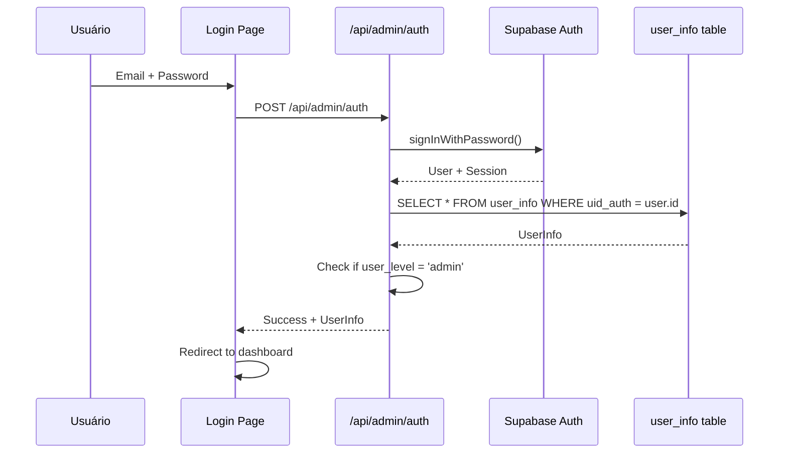

# Sistema de Login Admin - Configuração

## Visão Geral

O sistema de login admin foi integrado ao auth nativo do Supabase, permitindo autenticação segura e gerenciamento de usuários através da tabela `user_info`.

## Configuração Inicial

### 1. Criar a Tabela no Supabase

Execute o script SQL em `sql/create-user-info.sql` no editor SQL do Supabase:

```sql
-- Criar tabela user_info
CREATE TABLE IF NOT EXISTS public.user_info (
  id BIGSERIAL NOT NULL,
  username TEXT NOT NULL,
  email TEXT NOT NULL,
  user_level TEXT NOT NULL DEFAULT 'user'::text,
  full_name TEXT NOT NULL,
  created_at TIMESTAMP WITH TIME ZONE NULL DEFAULT NOW(),
  updated_at TIMESTAMP WITH TIME ZONE NULL DEFAULT NOW(),
  last_login TIMESTAMP WITH TIME ZONE NULL,
  is_active BOOLEAN NULL DEFAULT true,
  uid_auth UUID NULL,
  CONSTRAINT user_info_pkey PRIMARY KEY (id),
  CONSTRAINT user_info_email_key UNIQUE (email),
  CONSTRAINT user_info_username_key UNIQUE (username),
  CONSTRAINT user_info_uid_auth_fkey FOREIGN KEY (uid_auth) REFERENCES auth.users (id),
  CONSTRAINT user_info_user_level_check CHECK (
    (
      user_level = ANY (
        ARRAY['admin'::text, 'manager'::text, 'user'::text]
      )
    )
  )
) TABLESPACE pg_default;
```

### 2. Criar Primeiro Usuário Admin

1. **Via Dashboard do Supabase:**
   - Vá para Authentication > Users
   - Clique em "Add User"
   - Preencha email e senha
   - Copie o UUID gerado

2. **Inserir na tabela user_info:**
   ```sql
   INSERT INTO public.user_info (username, email, user_level, full_name, uid_auth)
   VALUES ('admin', 'admin@example.com', 'admin', 'Administrador', 'UUID_COPIADO_AQUI');
   ```

### 3. Testar o Login

1. Acesse: `http://localhost:3000/admin/login`
2. Use o email e senha criados no Supabase
3. Será redirecionado para `/admin/dashboard`

## Fluxo de Autenticação

### 1. Login Process


### 2. Proteção de Rotas

- **Layout Admin:** `/app/admin/layout.tsx`
  - Usa `AdminAuthProvider` para gerenciar estado
  - Verifica se usuário está autenticado
  - Verifica se `user_level === 'admin'`
  - Redireciona para `/admin/login` se não autorizado

### 3. Contexto de Autenticação

- **Arquivo:** `/context/admin-auth-context.tsx`
- **Funcionalidades:**
  - Gerencia estado de autenticação
  - Sincroniza com auth do Supabase
  - Busca dados do usuário na tabela `user_info`
  - Verifica permissões de admin

## Níveis de Usuário

- **admin:** Acesso total ao sistema
- **manager:** Acesso intermediário (para futuras funcionalidades)
- **user:** Acesso básico (para futuras funcionalidades)

## APIs Disponíveis

### 1. Autenticação: `/api/admin/auth`
- **POST:** Login com email/senha
- Retorna: `user`, `auth`, `session`

### 2. Gerenciamento de Usuários: `/api/admin/users`
- **GET:** Lista usuários com paginação
- **POST:** Criar novo usuário
- **PUT:** Atualizar usuário existente
- **DELETE:** Remover usuário

### 3. Página de Gerenciamento: `/admin/users`
- Interface para CRUD de usuários
- Busca e paginação
- Controle de níveis de acesso

## Segurança

### 1. Validações
- Email único no sistema
- Username único
- Níveis de usuário válidos
- Senhas seguras (via Supabase Auth)

### 2. Proteções
- Verificação de permissões em cada rota
- Middleware de autenticação
- Tokens JWT via Supabase

### 3. Boas Práticas
- Senhas gerenciadas pelo Supabase
- Logs de último login
- Controle de usuários ativos/inativos

## Uso

### 1. Acessar Sistema Admin
```
http://localhost:3000/admin/login
```

### 2. Gerenciar Usuários
```
http://localhost:3000/admin/users
```

### 3. Dashboard Principal
```
http://localhost:3000/admin/dashboard
```

## Troubleshooting

### 1. Erro "Credenciais inválidas"
- Verificar se email/senha estão corretos no Supabase Auth
- Confirmar que usuário existe na tabela `user_info`
- Verificar se `uid_auth` está corretamente vinculado

### 2. Erro "Acesso negado"
- Verificar se `user_level` é 'admin'
- Confirmar que usuário está ativo (`is_active = true`)

### 3. Erro "Usuário não encontrado"
- Verificar se existe registro na tabela `user_info`
- Confirmar que `uid_auth` corresponde ao ID do Supabase Auth

## Extensões Futuras

1. **Roles e Permissões:**
   - Sistema mais granular de permissões
   - Diferentes níveis de acesso por módulo

2. **Auditoria:**
   - Log de todas as ações administrativas
   - Histórico de alterações

3. **Recuperação de Senha:**
   - Integração com reset de senha do Supabase
   - Interface personalizada

4. **Autenticação 2FA:**
   - Integração com autenticação de dois fatores
   - Maior segurança para admins 