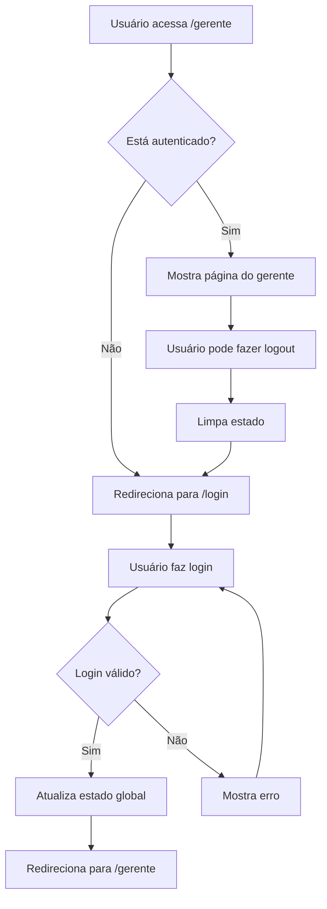

# 🔐 Sistema de Autenticação - PV Auto Proteção

## 📋 Visão Geral

Sistema completo de autenticação implementado usando **Supabase Auth** com:
- ✅ Página de login responsiva
- ✅ Proteção de rotas privadas
- ✅ Gerenciamento de estado global
- ✅ Área de perfil do usuário
- ✅ Logout funcional
- ✅ Persistência de sessão

## 🚀 Funcionalidades Implementadas

### 1. **Página de Login** (`/login`)
- Design moderno com gradiente
- Campos de email e senha
- Validação em tempo real
- Feedback visual de erros
- Redirecionamento automático após login
- Botão de mostrar/esconder senha

### 2. **Proteção de Rotas**
- Middleware de autenticação (`AuthGuard`)
- Verificação automática de sessão
- Redirecionamento para login se não autenticado
- Loading state durante verificação

### 3. **Área de Perfil do Usuário**
- Dropdown com informações do usuário
- Avatar com iniciais do email
- Detalhes da conta (email, ID, data de criação)
- Status online/offline
- Botão de logout integrado

### 4. **Gerenciamento de Estado Global**
- Context API para estado de autenticação
- Sincronização automática com Supabase
- Persistência de sessão entre recarregamentos
- Listeners para mudanças de estado

## 🛠️ Arquitetura

```
├── context/
│   ├── auth-context.tsx      # Context global de autenticação
│   └── form-context.tsx      # Context do formulário (existente)
├── components/
│   ├── auth-guard.tsx        # Componente de proteção de rotas
│   ├── user-profile.tsx      # Componente de perfil do usuário
│   └── ui/                   # Componentes de UI (existente)
├── lib/
│   ├── auth.ts              # Serviços de autenticação
│   └── supabase.ts          # Configuração do Supabase
├── app/
│   ├── login/
│   │   └── page.tsx         # Página de login
│   ├── gerente/
│   │   └── page.tsx         # Página protegida do gerente
│   └── layout.tsx           # Layout com AuthProvider
```

## 🔧 Como Usar

### 1. **Acessar o Sistema**
```
1. Vá para http://localhost:3000/gerente
2. Será redirecionado para /login automaticamente
3. Use qualquer email/senha válidos
4. Será redirecionado para /gerente após login
```

### 2. **Autenticação no Código**
```typescript
// Em qualquer componente
import { useAuth } from '@/context/auth-context'

function MeuComponente() {
  const { user, isAuthenticated, signOut } = useAuth()
  
  if (!isAuthenticated) {
    return <div>Não logado</div>
  }
  
  return (
    <div>
      <h1>Olá, {user.email}!</h1>
      <button onClick={signOut}>Logout</button>
    </div>
  )
}
```

### 3. **Proteger Rotas**
```typescript
// Proteger uma página inteira
import { AuthGuard } from '@/components/auth-guard'

export default function MinhaPageProtegida() {
  return (
    <AuthGuard>
      <div>Conteúdo protegido</div>
    </AuthGuard>
  )
}
```

## 🎨 Componentes Disponíveis

### `AuthGuard`
```typescript
<AuthGuard redirectTo="/login">
  <ComponenteProtegido />
</AuthGuard>
```

### `UserProfile`
```typescript
// Já integrado no header do gerente
<UserProfile />
```

### `useAuth` Hook
```typescript
const { 
  user,           // Usuário atual
  loading,        // Estado de carregamento
  isAuthenticated, // Se está autenticado
  signIn,         // Função de login
  signOut         // Função de logout
} = useAuth()
```

## 📱 Fluxo de Autenticação



## 🔒 Configuração do Supabase

### 1. **Configuração Atual**
```typescript
// lib/supabase.ts
const supabaseUrl = 'https://nxzzzkzuupgkqmscvscn.supabase.co'
const supabaseAnonKey = 'eyJhbGciOiJIUzI1NiIsInR5cCI6IkpXVCJ9...'
```

### 2. **Políticas de Segurança (RLS)**
- Autenticação habilitada no Supabase
- Usuários podem fazer login/logout
- Sessões são gerenciadas automaticamente

### 3. **Tabela de Usuários**
```sql
-- Tabela auth.users já existe no Supabase
-- Campos disponíveis:
-- - id (UUID)
-- - email (TEXT)
-- - created_at (TIMESTAMP)
-- - updated_at (TIMESTAMP)
```

## 🧪 Testando o Sistema

### 1. **Teste de Login**
```bash
# 1. Acesse http://localhost:3000/login
# 2. Use qualquer email válido (ex: admin@exemplo.com)
# 3. Use qualquer senha (ex: 123456)
# 4. Verifique se foi redirecionado para /gerente
```

### 2. **Teste de Proteção**
```bash
# 1. Acesse http://localhost:3000/gerente sem estar logado
# 2. Verifique se foi redirecionado para /login
# 3. Faça login e veja se volta para /gerente
```

### 3. **Teste de Logout**
```bash
# 1. Estando logado, clique no avatar no canto superior direito
# 2. Clique em "Sair" no dropdown
# 3. Verifique se foi redirecionado para /login
```

## 🎛️ Configurações Avançadas

### 1. **Customizar Redirecionamentos**
```typescript
// Em auth-guard.tsx
<AuthGuard redirectTo="/minha-pagina-login">
  <ComponenteProtegido />
</AuthGuard>
```

### 2. **Adicionar Mais Campos ao Usuário**
```typescript
// Em auth-context.tsx
interface AuthUser {
  id: string
  email: string
  name?: string
  avatar_url?: string
  role?: string  // Adicionar roles
}
```

### 3. **Configurar Roles/Permissões**
```typescript
// Exemplo de sistema de roles
const { user } = useAuth()

if (user?.role !== 'admin') {
  return <div>Sem permissão</div>
}
```

## 🚨 Troubleshooting

### 1. **Erro de Autenticação**
```
❌ Erro: Invalid login credentials
✅ Solução: Verificar se o usuário existe no Supabase
```

### 2. **Redirecionamento Infinito**
```
❌ Erro: Loop infinito entre /login e /gerente
✅ Solução: Verificar se AuthGuard está envolvendo corretamente
```

### 3. **Estado não Persistindo**
```
❌ Erro: Perde autenticação ao recarregar
✅ Solução: Verificar se AuthProvider está no layout principal
```

## 🔮 Próximos Passos

### 1. **Implementar Roles**
- [ ] Adicionar campo `role` na tabela de usuários
- [ ] Criar middleware para verificar permissões
- [ ] Implementar diferentes níveis de acesso

### 2. **Melhorar UX**
- [ ] Adicionar loading states mais elaborados
- [ ] Implementar toast notifications
- [ ] Adicionar animações de transição

### 3. **Segurança Adicional**
- [ ] Implementar 2FA
- [ ] Adicionar rate limiting
- [ ] Implementar refresh tokens

## 📞 Suporte

Para dúvidas ou problemas:
1. Verificar console do navegador
2. Verificar logs do Supabase
3. Consultar documentação do Supabase Auth

---

✅ **Sistema de autenticação totalmente funcional e pronto para uso!** 