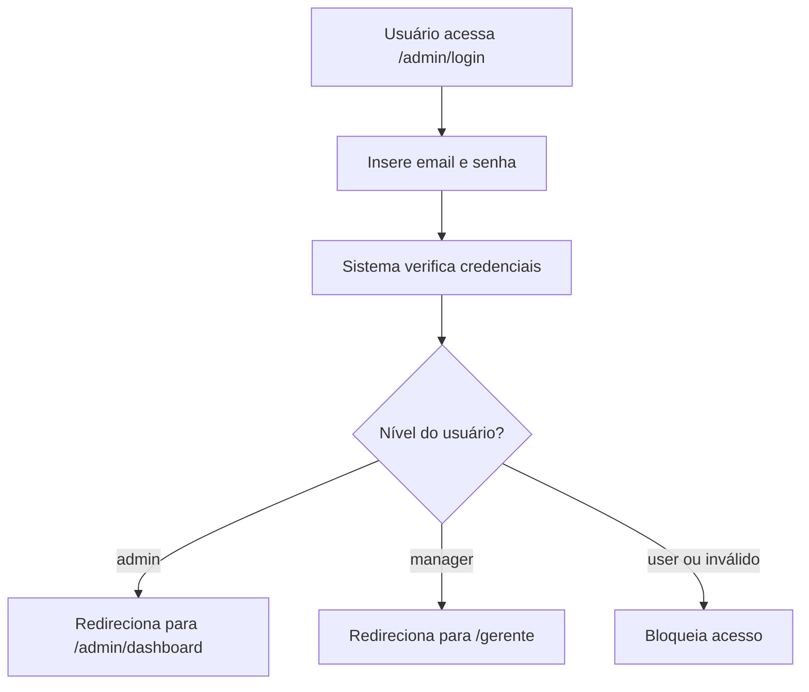

# Sistema de Login Unificado

## Visão Geral

O sistema de login foi unificado para usar uma única rota de autenticação (`/admin/login`) que redireciona os usuários conforme seu nível de acesso.

## Rotas de Login

### ❌ **Removida**
- `/login` - Esta rota foi **excluída** do sistema

### ✅ **Única rota de login**
- `/admin/login` - Rota unificada para todos os usuários do sistema

## Fluxo de Autenticação



## Níveis de Usuário

### 🔴 **Admin**
- **Acesso:** Total ao sistema
- **Redirecionamento:** `/admin/dashboard`
- **Permissões:** 
  - Gerenciar usuários
  - Acessar dashboard administrativo
  - Visualizar métricas completas
  - Gerenciar chamadas IA

### 🟡 **Manager**
- **Acesso:** Área de gerência
- **Redirecionamento:** `/gerente`
- **Permissões:**
  - Visualizar relatórios
  - Gerenciar operações
  - Acesso limitado ao sistema

### 🔵 **User**
- **Acesso:** Bloqueado no sistema interno
- **Redirecionamento:** Nenhum (erro de acesso)

## Proteção de Rotas

### `/admin/*` (Layout: `app/admin/layout.tsx`)
- ✅ **Admin:** Acesso completo
- ❌ **Manager:** Redirecionado para `/gerente`
- ❌ **User:** Bloqueado

### `/gerente/*` (Layout: `app/gerente/layout.tsx`)
- ✅ **Admin:** Acesso permitido
- ✅ **Manager:** Acesso permitido
- ❌ **User:** Bloqueado

## Configuração Técnica

### 1. **API de Autenticação** (`/api/admin/auth`)
```typescript
// Aceita admin e manager
if (userInfo.user_level !== 'admin' && userInfo.user_level !== 'manager') {
  return NextResponse.json(
    { error: 'Acesso negado. Apenas administradores e gerentes podem acessar.' },
    { status: 403 }
  )
}
```

### 2. **Contexto de Autenticação** (`context/admin-auth-context.tsx`)
```typescript
// Aceita admin e manager
if (!error && userInfo && (userInfo.user_level === 'admin' || userInfo.user_level === 'manager')) {
  setUser(userInfo)
}

// isAdmin retorna true para admin e manager
isAdmin: user?.user_level === 'admin' || user?.user_level === 'manager'
```

### 3. **Redirecionamento Automático** (`app/admin/login/page.tsx`)
```typescript
useEffect(() => {
  if (isAuthenticated && user) {
    if (user.user_level === 'admin') {
      router.push('/admin/dashboard')
    } else if (user.user_level === 'manager') {
      router.push('/gerente')
    }
  }
}, [isAuthenticated, user, router])
```

## Segurança

### 1. **Verificação de Nível**
- API verifica nível na tabela `user_info`
- Layout protege rotas conforme permissão
- Redirecionamento automático impede acesso indevido

### 2. **Proteção de Rotas**
- **Admin Layout:** Bloqueia managers de acessar `/admin/*`
- **Gerente Layout:** Permite admin e manager em `/gerente/*`
- **Sessão Supabase:** Mantém autenticação segura

### 3. **Validação Contínua**
- Contexto monitora mudanças de autenticação
- Layouts verificam permissões a cada navegação
- Tokens JWT validados pelo Supabase

## Atualização de Dados

### Alterar Nível de Usuário
```sql
UPDATE public.user_info 
SET user_level = 'manager' 
WHERE email = 'usuario@exemplo.com';
```

### Criar Novo Manager
```sql
-- 1. Criar no Supabase Auth (via Dashboard)
-- 2. Inserir na tabela user_info
INSERT INTO public.user_info (username, email, user_level, full_name, uid_auth)
VALUES ('gerente1', 'gerente@exemplo.com', 'manager', 'Nome do Gerente', 'UUID_DO_SUPABASE');
```

## Processo de Login

1. **Usuário acessa** `/admin/login`
2. **Insere credenciais** (email + senha)
3. **Sistema valida** via Supabase Auth
4. **Busca dados** na tabela `user_info`
5. **Verifica nível** (admin/manager)
6. **Redireciona automaticamente:**
   - Admin → `/admin/dashboard`
   - Manager → `/gerente`

## Benefícios

✅ **Unificação:** Uma única página de login para todo o sistema
✅ **Flexibilidade:** Suporte a múltiplos níveis de usuário
✅ **Segurança:** Proteção robusta de rotas
✅ **UX:** Redirecionamento automático conforme permissão
✅ **Manutenção:** Código centralizado e organizado

## Pontos de Acesso

### Para Clientes
- Continuam usando `/login_cliente` (não alterado)

### Para Funcionários
- **Todos** usam `/admin/login`
- Redirecionamento automático conforme nível

### Links Atualizados
- Botão "Acesso ao Sistema" em `/login_cliente` → `/admin/login`
- Sistema detecta nível e redireciona automaticamente 