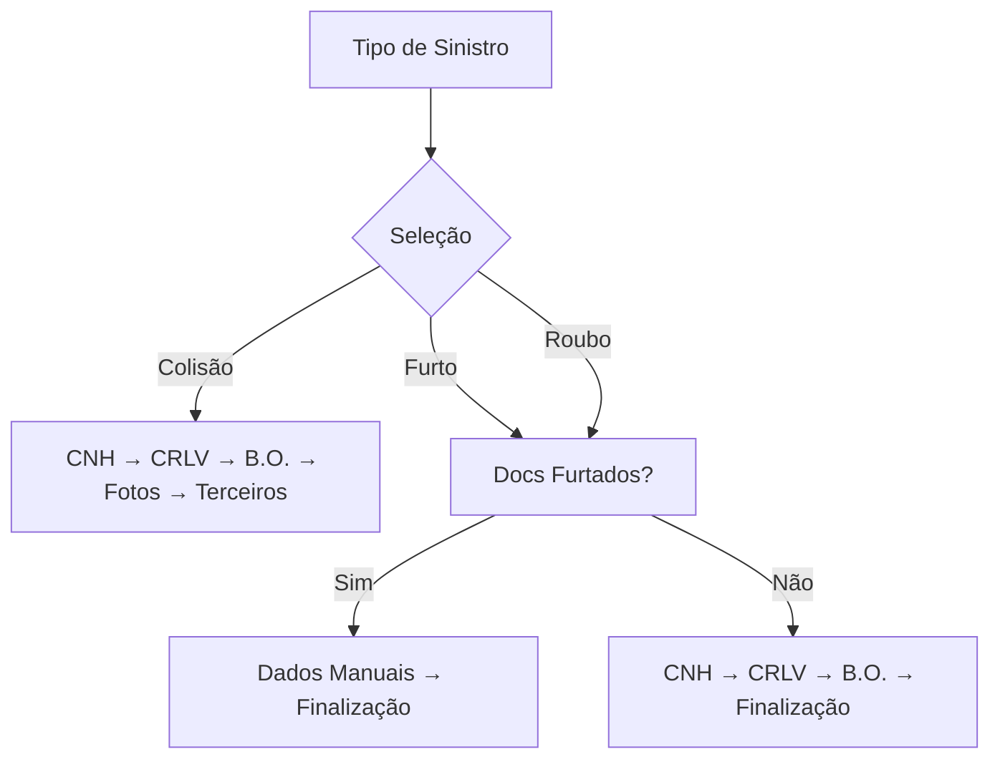

# 🚨 Novo Tipo de Sinistro: ROUBO

## 📋 Alterações Implementadas

Adicionado o tipo **ROUBO** como terceira opção no passo "Tipo de Sinistro", junto com as diferenças explicativas entre Furto e Roubo.

### 🎯 **Diferenças Legais Implementadas:**

#### 🟣 **FURTO**
- **Definição**: Veículo levado sem confronto direto com o proprietário
- **Exemplos**: Veículo deixado destrancado, chaves esquecidas, arrombamento na ausência do dono
- **Cor**: Roxo/Purple

#### 🔴 **ROUBO** 
- **Definição**: Veículo levado mediante intimidação ou ameaça ao proprietário
- **Exemplos**: Abordagem com arma, sequestro relâmpago, coação direta
- **Cor**: Vermelho
- **Urgência**: B.O. deve ser registrado imediatamente

#### 🟠 **COLISÃO**
- **Definição**: Acidente que causou danos ao seu veículo
- **Exemplos**: Batidas, engavetamentos, colisões com postes ou muros
- **Cor**: Laranja

## 🛠️ **Arquivos Modificados:**

### 1. **Tipos TypeScript**
```typescript
// types/index.ts
export type TipoSinistro = "colisao" | "furto" | "roubo" | null
```

### 2. **Componente Principal**
```typescript
// components/steps/step-tipo-sinistro.tsx
- Layout alterado para 3 colunas (grid-cols-3)
- Botão ROUBO adicionado com ícone Sword
- Descrições explicativas em cada tipo
- Informações detalhadas com boxes coloridos
```

### 3. **Contexto do Formulário**
```typescript
// context/form-context.tsx
- Lógica de navegação atualizada
- Roubo tratado igual ao Furto (mesma documentação)
- Validações ajustadas
```

### 4. **Interface de Dados**
```typescript
// lib/supabase.ts
tipo_sinistro: 'colisao' | 'furto' | 'roubo'
```

### 5. **Página do Gerente**
```typescript
// app/gerente/page.tsx
- Badge atualizado para mostrar os 3 tipos
- Labels corretos na visualização
```

### 6. **Componente de Documentos**
```typescript
// components/documentos-form.tsx
- Progresso calculado para incluir roubo
- Renderização correta dos steps
```

## 🎨 **Design Responsivo**

### **Layout Desktop (lg+):**
```
┌─────────────┬─────────────┬─────────────┐
│   COLISÃO   │    FURTO    │    ROUBO    │
│   🚗 🟠     │   🛡️ 🟣     │   ⚔️ 🔴     │
└─────────────┴─────────────┴─────────────┘
```

### **Layout Tablet (sm-lg):**
```
┌─────────────┬─────────────┐
│   COLISÃO   │    FURTO    │
└─────────────┴─────────────┘
┌─────────────────────────────┐
│           ROUBO             │
└─────────────────────────────┘
```

### **Layout Mobile (< sm):**
```
┌─────────────────────────────┐
│          COLISÃO            │
├─────────────────────────────┤
│           FURTO             │
├─────────────────────────────┤
│           ROUBO             │
└─────────────────────────────┘
```

## 📱 **Características Visuais:**

### **Botões de Seleção:**
- **Altura otimizada**: `h-32 sm:h-36` (compacto e funcional)
- **Cores distintas**: Laranja, Roxo, Vermelho
- **Ícones específicos**: Car, ShieldAlert, Sword
- **Textos ajustados**: Tamanho reduzido para melhor fit
- **Animações**: Scale e shadow quando selecionado

### **Informações Explicativas:**
- **Boxes coloridos** com definições legais
- **Exemplos práticos** de cada tipo
- **Lista de documentos** necessários
- **Alertas de urgência** para roubo

## 🔄 **Fluxo de Navegação:**



## ✅ **Funcionalidades:**

- ✅ **3 tipos de sinistro** disponíveis
- ✅ **Descrições legais** claras e precisas
- ✅ **Layout responsivo** para todos os dispositivos
- ✅ **Validação consistente** em todo o sistema
- ✅ **Build funcionando** sem erros
- ✅ **Documentação completa** da diferença entre tipos

## 🎯 **Benefícios:**

1. **Clareza Legal**: Usuários entendem a diferença entre furto e roubo
2. **Linguagem Suave**: Descrições diretas sem termos agressivos
3. **Layout Otimizado**: Botões compactos com descrições dentro
4. **Documentação Adequada**: Cada tipo tem instruções específicas
5. **UX Melhorada**: Visual mais informativo e educativo
6. **Conformidade**: Termos legalmente corretos
7. **Urgência Destacada**: Roubo tem alertas especiais

---

✅ **Implementação completa do tipo ROUBO com diferenciação legal clara!** 